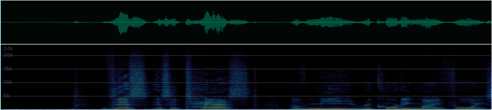

# wavegram

Lightweight Web Component for previewing audio with a synchronized waveform, spectrogram, and playback cursor. It is intended for research demos, paper companion pages, audio dataset previews, and source-separation result comparisons.

Wavegram aims to provide a minimal, academic, and scientific visualization surface rather than a general-purpose media player or audio editor.

It is not an editor. It does not implement recording, effects, multitrack editing, annotation editing, ASR, or server-side processing.

## Design Focus

Wavegram is closest in spirit to lightweight waveform players, but its primary view is not just a waveform. It always treats waveform and spectrogram as two synchronized views over the same audio timeline.

The core feature set is deliberately narrow:

- Simultaneous waveform and spectrogram display.
- One playback cursor rendered at the same time position in both views.
- Click-to-seek from either waveform or spectrogram. By default, clicking a stopped player starts playback from that position, and clicking a playing player pauses after seeking.
- Minimal, low-decoration presentation suitable for academic papers, scientific demos, and dataset browsers.
- No DAW-style editing, multitrack arrangement, effects, recording, or annotation workflow.

## Install

```sh
npm install wavegram
```

```ts
import "wavegram";
```

## Minimal Usage

```html
<wavegram-player
  src="https://raw.githubusercontent.com/pdx-cs-sound/wavs/main/voice.wav"
></wavegram-player>
```



The package is named `wavegram`. The custom element tag is `wavegram-player` because browser custom element names must contain a hyphen.

The `src` value may be a relative URL such as `audio/example.wav` or an absolute URI such as the example above.
Remote audio must be served with CORS headers so the component can fetch and decode it for waveform and spectrogram analysis.

```ts
const player = document.createElement("wavegram-player");
player.src = "https://raw.githubusercontent.com/pdx-cs-sound/wavs/main/voice.wav";
document.body.appendChild(player);
```

## Attributes

| Attribute | Property | Default | Description |
| --- | --- | --- | --- |
| `src` | `src` | `""` | Audio URL. Uses browser-supported `decodeAudioData()` formats. |
| `height` | `height` | `200` | Total visual height. Used to auto-allocate pane heights when individual heights are not set. |
| `waveform-height` | `waveformHeight` | `80` | Waveform canvas height in CSS pixels. |
| `spectrogram-height` | `spectrogramHeight` | `120` | Spectrogram canvas height in CSS pixels. |
| `show-waveform` | `showWaveform` | `true` | Show waveform pane. |
| `show-spectrogram` | `showSpectrogram` | `true` | Show spectrogram pane. |
| `show-controls` | `showControls` | `false` | Show the play/pause button. |
| `show-time` | `showTime` | `false` | Show current time and duration. |
| `waveform-style` | `waveformStyle` | `waveform` | `waveform`, `bars`, `lines`, `blocks`, or `dots`. `line` is accepted as a legacy alias. |
| `waveform-bar-width` | `waveformBarWidth` | style-dependent | Width of bars, blocks, or dots in CSS pixels. |
| `waveform-bar-spacing` | `waveformBarSpacing` | style-dependent | Spacing between bars, blocks, or dots in CSS pixels. |
| `autoplay` | `autoplay` | `false` | Start playback after loading. Browser autoplay policies still apply. |
| `fft-size` | `fftSize` | `1024` | Radix-2 FFT size. Non-power-of-two values are errors. |
| `hop-size` | `hopSize` | `256` | STFT hop size in samples. |
| `window-type` | `windowType` | `hann` | `hann`, `hamming`, or `rectangular`. |
| `min-db` | `minDb` | `-80` | Lower display bound. |
| `max-db` | `maxDb` | `0` | Upper display bound. |
| `color-map` | `colorMap` | `audition` | `audition`, `gray`, `magma`, `viridis`, or `inferno`. |
| `channel` | `channel` | `mix` | `mix` or zero-based channel index. |

## Events

The component dispatches `CustomEvent`s named `loadstart`, `loaded`, `play`, `pause`, `seek`, `timeupdate`, `profile`, `playprofile`, and `error`.

Normal event detail:

```ts
{
  currentTime: number;
  duration: number;
}
```

Error event detail:

```ts
{
  message: string;
  cause?: unknown;
}
```

`profile` reports load and analysis timing in milliseconds. It is emitted once when the player first becomes usable and again when spectrogram analysis finishes:

```ts
{
  fetchMs: number;
  audioReadyMs: number;
  decodeMs: number;
  waveformMs: number;
  spectrogramMs?: number;
  firstUsableMs: number;
  totalMs?: number;
}
```

`playprofile` reports playback startup latency:

```ts
{
  playToPlayingMs: number;
}
```

## Spectrogram Settings

Spectrograms are computed with STFT:

```text
S[k, t] = 20 log10(|FFT(x_t)[k]| + 1e-10)
```

The internal `values` layout is time-major:

```ts
values[t * freqBins + k]
```

The initial implementation uses a pure TypeScript radix-2 FFT and runs spectrogram analysis in a Web Worker when Workers are available. If Workers are unavailable, the component can fall back to waveform-only or main-thread analysis depending on the environment.

## Browser Support

Audio decoding follows `AudioContext.decodeAudioData()` support in the user's browser. WAV, MP3, and Ogg Vorbis are common targets. FLAC support is browser-dependent.

Playback uses `HTMLAudioElement`; waveform and spectrogram analysis use `AudioBuffer`.

## Backward Compatibility

The recommended element name is `<wavegram-player>`.
The older `<audio-preview-spectrogram>` tag is still registered as a compatibility alias.

## Demo Audio

The examples use WAV files from [`pdx-cs-sound/wavs`](https://github.com/pdx-cs-sound/wavs), a sample collection for Portland State University's Computers, Sound and Music course. The repository states that the files are Creative Commons CC0 unless otherwise indicated.

The 16 kHz keyword-spotting example uses a WAV file from [`fkuhne/KWS-Dataset`](https://github.com/fkuhne/KWS-Dataset). Its `wavs` directory is described by that project as WAV audio converted to 16 kHz and is distributed under CC0-1.0.

## Acknowledgements

Wavegram is inspired by [`wavesurfer.js`](https://wavesurfer.xyz/), especially its lightweight browser-based waveform player model. Wavegram is an independent implementation focused on synchronized waveform and spectrogram previews for research demos and dataset browsing.

## Styling

The component uses Shadow DOM and supports CSS custom properties:

```css
wavegram-player {
  --ap-bg: #ffffff;
  --ap-fg: #222222;
  --ap-waveform-bg: #020604;
  --ap-waveform: rgba(0, 214, 163, 0.34);
  --ap-waveform-played: #00f0b5;
  --ap-waveform-center: rgba(0, 92, 58, 0.7);
  --ap-waveform-progress: #00f0b5;
  --ap-cursor: #00d7ff;
  --ap-cursor-shadow: rgba(0, 0, 0, 0.45);
  --ap-spectrogram-tick: rgba(255, 255, 255, 0.42);
  --ap-spectrogram-unplayed-opacity: 0.48;
  --ap-border: #dddddd;
}
```

## Known Limitations

Long audio files are supported conservatively in the initial version. Large decoded buffers can still consume significant memory, and precomputed waveform or spectrogram JSON is reserved for a future extension.

The component fetches each audio source once, then creates a Blob URL for playback and decodes the same `ArrayBuffer` for analysis. This avoids a second network request for `HTMLAudioElement` playback.

## Development

```sh
npm install
npm run build
npm test
npm run test:e2e
```

## Examples

Run the local dev server:

```sh
npm run dev -- --port 4173
```

Then open:

- `http://127.0.0.1:4173/examples/index.html`

For automated local checks, run:

```sh
npm run test
npm run typecheck
npm run build
npm run test:e2e
```

## License

MIT
